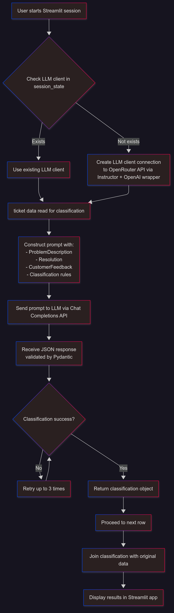

---
# 🧠 Text Classification with LLM — Explanation

---

## 🔧 How the Program Works

When a user starts a session, the program creates a connection to the **OpenRouter API**.

This connection allows the app to interact with various language models via the **OpenAI-compatible Chat Completions API**.

---

## High-level FlowChart




## 🧩 Why I Use `Instructor`

To structure and simplify communication with the model, I use the **`Instructor`** Python module.

`Instructor` acts as a bridge between:

- The **LLM output**  
- And **Pydantic**, a library for defining and validating structured data models

---

## 🛠 Model Being Used

I typically use one of the following models:

- Mistral (24B parameters)  
- Llama 3.1 (8B parameters) — especially when testing locally  
- GPT-4.0 mini  

---

## 🔢 Usage Count

I track usage count to restrict how many times a user can run the app, due to API credit limits with OpenRouter.

---

## 📚 Why I Use the `typing` Module

The `typing` module helps define **allowed values** for fields, which are then passed into the Pydantic classes to enforce strict validation.

---

## 🏷 Labels for Classification

I use `typing.Literal` to explicitly specify the **allowed categories** for classification.

---

## 📝 Explanation for Labels

Each label is carefully defined to ensure the LLM understands the classification criteria. For example:

- `'TIME_WAITING'`: Feedback that **explicitly mentions** long call waiting times, call queue lengths, or delays in receiving responses. This includes complaints about waiting for responses or resolution timeframes.

---

## 📊 Sample Data

I created a synthetic dataset based on customer feedback for a flight, generated with ChatGPT. The structure mimics typical ticketing management systems. Example:


```json
{
  "Row_ID": 10,
  "ProblemDescription": "I need help with changing my flight date.",
  "Resolution": "Here’s the link to change your booking online.",
  "CustomerFeedback": "The website process was unclear and I couldn’t change my flight."
}
```
---

## 🏗 Pydantic Classes

The main schema class is `TicketClassification`, which includes:

- **Category**: A list of allowed labels (from the defined categories). Converted to a `List` to allow multiple selections and marked as required using `Field()`.  
- **Justification**: Text explaining why these categories were selected.  
- **Sentiment**: A float representing how negative the feedback is.  
- **Confidence**: A float representing how confident the model is in the classification.

---

## ⚙️ Classification Function

- The function makes **one API call per ticket**.  
- Up to **3 attempts** are made to classify each ticket (retry on failure).  
- The prompt explicitly instructs the model to consider the `ProblemDescription` and `Resolution` fields but to focus primarily on the `CustomerFeedback`.  
- The `CATEGORY_DEFINITIONS` provide guidance to the model on classification criteria.  
- Using `Instructor.Mode.JSON`, the model is expected to return a **valid JSON** matching the `TicketClassification` schema.  
- The prompt is sent to the **Chat Completions API**, which is designed for conversational interactions where the user sends a message, and the model responds accordingly.  
- The `role` is set to `"user"` with the constructed prompt as content.  
- The parameter `response_model=TicketClassification` tells the system to **validate and parse the response against the Pydantic model**.  
- On success, the function returns the classification object. On failure after 3 attempts, it returns a default object noting the failure.

---

## 🚀 Final Steps

Since the classification results are stored in a dictionary, we can access the classification and `Row_ID` and then join this back to the original dataframe to display the complete information in the Streamlit app.

---
